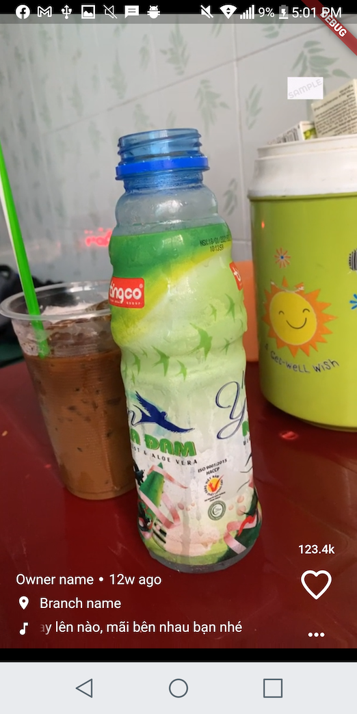

# flutter_video_newfeed

This module will provide the list of video in the newfeed screen like tiktok.



## Usage
1. Add module from pubspec.yaml

```yaml
  flutter_video_newfeed:
    git:
      url: https://github.com/quochuynh67/flutter_video_newfeed
```
or
```yaml
    flutter_video_newfeed: 1.0.0
```
## Implement Video API
 For example you create your own model class

```dart
class YourOwnModel extends VideoInfo{
    int yourCustomField;
    YourOwnModel(this.yourCustomField);
}
```
```dart
class YourApi implement VideoNewFeedApi<YourOwnModel>{
    @override
  Future<List<YourOwnModel>> getListVideo() {
    return Future.value([
      YourOwnModel(
          userName: "quochuynh96",
          liked: true,
          songName: "Đưa tay lên nào, mãi bên nhau bạn nhé!",
          url:'https://flutter.github.io/assets-for-api-docs/assets/videos/butterfly.mp4'),
    ]);
  }

  @override
  Future<List<YourOwnModel>> loadMore(List<YourOwnModel> currentList) {
    return Future.value([
      YourOwnModel(
          userName: "quochuynh96 load more",
          liked: true,
          songName: "Đưa tay lên nào, mãi bên nhau bạn nhé!",
          url:'https://flutter.github.io/assets-for-api-docs/assets/videos/butterfly.mp4'),
    ]);
}
```


## Implement VideoNewFeedScreen

```dart
class _MyHomePageState extends State<MyHomePage>
    implements VideoNewFeedApi<VideoInfo> {
  @override
  Widget build(BuildContext context) {
    return Scaffold(
      body: VideoNewFeedScreen(api: this),
    );
  }
}
```
## Customizable Video Item Widget with your own design
In case you don't want to use Default Widget you can change by your own design, by:

```dart
class _MyHomePageState extends State<MyHomePage>
    implements VideoNewFeedApi<YourOwnModel> {
  @override
  Widget build(BuildContext context) {
    return Scaffold(
      body: VideoNewFeedScreen<YourOwnModel>(api: this,
      customVideoInfoWidget:(BuildContext context, YourOwnModel yourCustomVideo){
          ///
          /// Change your design here
          ///
          return Container(child: Text("${yourCustomVideo.yourCustomField}")
      }),
    );
  }
}
```


## Config video item 
```dart
class VideoItemConfig {
  /// In case: use to loop the video
  ///
  final bool loop;

  /// In case: auto play next video when current video is ended
  ///
  final bool autoPlayNextVideo;

  /// In case: use to change aspect ratio
  /// Default: video ratio
  ///
  final double customAspectRatio;

  final Widget itemLoadingWidget;

  const VideoItemConfig({
    this.loop,
    this.autoPlayNextVideo,
    this.itemLoadingWidget,
    this.customAspectRatio,
  });
}

```

